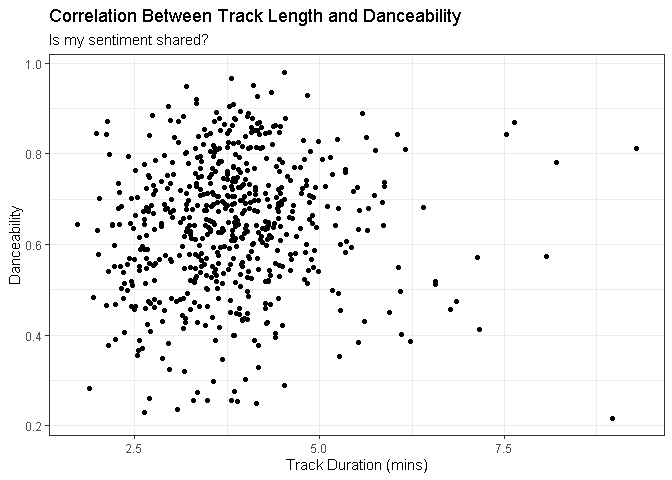
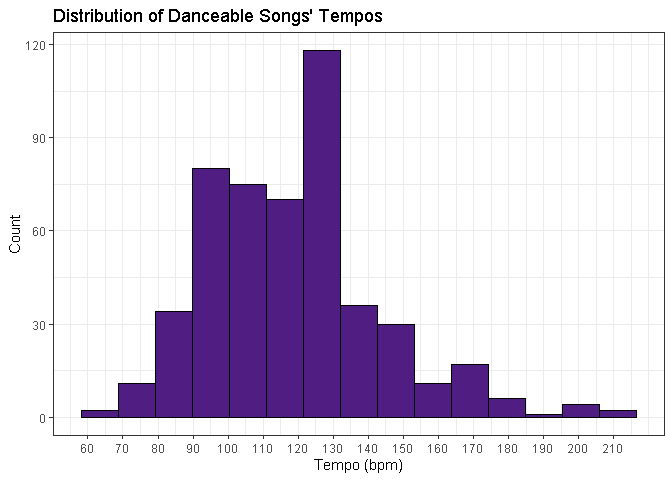
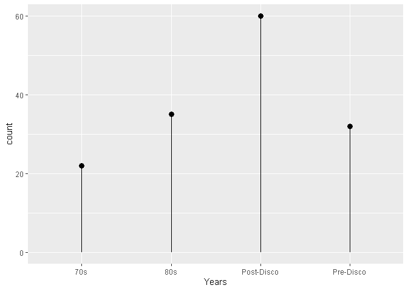

# Data Visualization Project 01

Load Tidyverse:

```r
library(tidyverse)
```

```
## Warning: package 'tidyverse' was built under R version 4.3.3
```

```
## Warning: package 'ggplot2' was built under R version 4.3.2
```

```
## Warning: package 'tibble' was built under R version 4.3.2
```

```
## Warning: package 'tidyr' was built under R version 4.3.2
```

```
## Warning: package 'readr' was built under R version 4.3.3
```

```
## Warning: package 'purrr' was built under R version 4.3.2
```

```
## Warning: package 'dplyr' was built under R version 4.3.2
```

```
## Warning: package 'forcats' was built under R version 4.3.3
```

```
## Warning: package 'lubridate' was built under R version 4.3.3
```

```
## ── Attaching core tidyverse packages ──────────────────────── tidyverse 2.0.0 ──
## ✔ dplyr     1.1.4     ✔ readr     2.1.5
## ✔ forcats   1.0.0     ✔ stringr   1.5.0
## ✔ ggplot2   3.4.4     ✔ tibble    3.2.1
## ✔ lubridate 1.9.3     ✔ tidyr     1.3.0
## ✔ purrr     1.0.2     
## ── Conflicts ────────────────────────────────────────── tidyverse_conflicts() ──
## ✖ dplyr::filter() masks stats::filter()
## ✖ dplyr::lag()    masks stats::lag()
## ℹ Use the conflicted package (<http://conflicted.r-lib.org/>) to force all conflicts to become errors
```

Load the raw data into environment:

```r
# create a string variable with the location of the file

suhits_link <- "https://raw.githubusercontent.com/reisanar/datasets/master/all_billboard_summer_hits.csv"

# read the file using the read_csv() function
suhits <- read_csv(suhits_link)
```

```
## Rows: 600 Columns: 22
## ── Column specification ────────────────────────────────────────────────────────
## Delimiter: ","
## chr (10): key, mode, track_uri, key_mode, playlist_name, playlist_img, track...
## dbl (12): danceability, energy, loudness, speechiness, acousticness, instrum...
## 
## ℹ Use `spec()` to retrieve the full column specification for this data.
## ℹ Specify the column types or set `show_col_types = FALSE` to quiet this message.
```
#Exploring relationships between BPM and top 10 hits:

One curious thing I find when thinking about dance music is the length of the tracks! Too long and it feels like you get bored or suddenly feel like it no longer feels fun. Too short and it might be ignored enough to not be so popular. The data set can be examined for the correlation between danceability and duration by plotting a distribution across all available years:


```r
  suhits2 <- mutate(suhits,duration_m=duration_ms/1000/60)
  suhits2 %>%
ggplot(mapping = aes(x = duration_m,y = danceability)) + 
    geom_point() +
    labs(title = "Correlation Between Track Length and Danceability",
         subtitle = "Is my sentiment shared?",
         x = "Track Duration (mins)",
         y = "Danceability") +
    theme_bw()
```

<!-- -->

From this result, we can infer that there is no apparent correlation between the length of the track and its danceability. Surprisingly, there are quite a few tracks that last more than 5 minutes and are rated as highly danceable.

## Are high tempo tracks rated highly danceable?
If we filter the data to only include highly danceable songs (rating>0.5), it would be expected that the resultant distribution of tempos falls somewhere around 120 bpm (as expected of disco music). Does this assumption hold true?


```r
suhits3 <- suhits2 %>%
  filter(danceability>0.5)
ggplot(data = suhits3,mapping = aes(tempo)) +
  #Color it FL Poly Purple for fun:
  geom_histogram(bins=15, color = "black", fill="#501D83") +
  scale_x_continuous(breaks = seq(0, max(suhits3$tempo), by = 10)) +
  labs(title = "Distribution of Danceable Songs' Tempos", x = "Tempo (bpm)", y = "Count") +
theme_bw()
```

<!-- -->

This indicates that 115-130 is closer to the most common tempos of the billboard top 10 hits since 1958.
As a curiosity, form this range, what percentage fall around the disco era? Namely 1970s to 1980s.


```r
suhits4 <- suhits3 %>%
  #Filter tempos of interest
  filter(tempo>115 & tempo<130) %>%
  #Add column to indicate era of interest
  mutate(Years=ifelse(between(year,1980,1989),"80s",ifelse(between(year,1970,1979),"70s",ifelse(year<1970,"Pre-Disco","Post-Disco")))) %>%
  group_by(Years) %>%
  #Count total entries in each category
  summarise(count = n()) %>%
  #Re-arrange to match chronological order
  arrange(match(Years, c("Pre-Disco", "70s", "80s","Post-Disco")))
ggplot(data = suhits4,mapping = aes(x = Years,y = count)) +
  geom_point(size = 3) + 
  geom_segment( aes(x=Years, xend=Years, y=0, yend=count))
```

<!-- -->

```r
  labs(title = "Distribution of Danceable Songs' Tempos", x = "Tempo (bpm)", y = "Count") +
theme_bw()
```

```
## NULL
```

The hits falling into the disco era make up about 38% of the total hits with a tempo between 115 and 130. This is significant when compared to the Post-Disco proportion of about 40%. This may indicate that Disco had a great influence in what are considered "hits" by the billboard top 10. We often associate higher beat counts as more danceable and relate that feeling with happiness, suggesting that there is a correlation between the bpm and the likelyhood of a song becoming a billboard top 10. Of course there are many factors that go into this decision, however, it seems to be easier to achieve if you have a higher bpm count.
