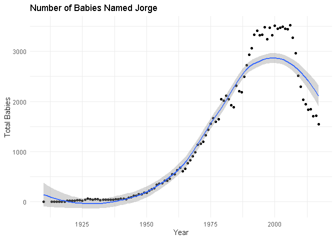
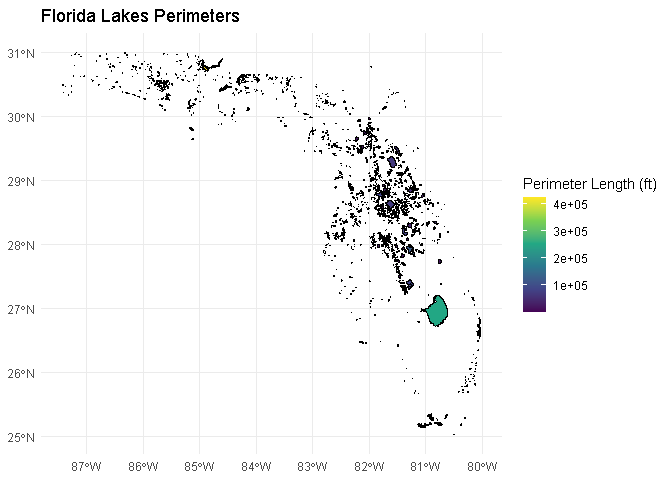

# Data Visualization Project 02

Load Tidyverse,plotly, and SF libraries:

```r
library(tidyverse)
```

```
## Warning: package 'tidyverse' was built under R version 4.3.3
```

```
## Warning: package 'ggplot2' was built under R version 4.3.2
```

```
## Warning: package 'tibble' was built under R version 4.3.2
```

```
## Warning: package 'tidyr' was built under R version 4.3.2
```

```
## Warning: package 'readr' was built under R version 4.3.3
```

```
## Warning: package 'purrr' was built under R version 4.3.2
```

```
## Warning: package 'dplyr' was built under R version 4.3.2
```

```
## Warning: package 'forcats' was built under R version 4.3.3
```

```
## Warning: package 'lubridate' was built under R version 4.3.3
```

```
## ── Attaching core tidyverse packages ──────────────────────── tidyverse 2.0.0 ──
## ✔ dplyr     1.1.4     ✔ readr     2.1.5
## ✔ forcats   1.0.0     ✔ stringr   1.5.0
## ✔ ggplot2   3.4.4     ✔ tibble    3.2.1
## ✔ lubridate 1.9.3     ✔ tidyr     1.3.0
## ✔ purrr     1.0.2     
## ── Conflicts ────────────────────────────────────────── tidyverse_conflicts() ──
## ✖ dplyr::filter() masks stats::filter()
## ✖ dplyr::lag()    masks stats::lag()
## ℹ Use the conflicted package (<http://conflicted.r-lib.org/>) to force all conflicts to become errors
```

```r
library(sf)
```

```
## Warning: package 'sf' was built under R version 4.3.3
```

```
## Linking to GEOS 3.11.2, GDAL 3.8.2, PROJ 9.3.1; sf_use_s2() is TRUE
```

```r
library(plotly)
```

```
## Warning: package 'plotly' was built under R version 4.3.2
```

```
## 
## Attaching package: 'plotly'
## 
## The following object is masked from 'package:ggplot2':
## 
##     last_plot
## 
## The following object is masked from 'package:stats':
## 
##     filter
## 
## The following object is masked from 'package:graphics':
## 
##     layout
```

Load the raw data into environment:

```r
# Navigate to \data folder and choose files
search_babynames <- file.choose()
# read the file using the read_csv() function
babynames <- readRDS(search_babynames)
# read the Florida Lakes shapes shp file
Lake_shapes <- read_sf(file.choose())
```


```r
#load htmlwidgets library
library(htmlwidgets)
#Generate a plot and assign a name
n_jorge <- babynames %>%
  filter(name=="Jorge") %>%
  group_by(year) %>%
  summarize(Total=sum(n)) %>%
  rename(Year="year")
p1<-ggplot(n_jorge,mapping=aes(x=Year,y=Total)) +
  geom_point() +
  labs(title = "Number of Babies Named Jorge",
         x = "Year",
         y = "Total Babies") +
  theme_minimal()
#Make it interactive
interactive_plot <- ggplotly(p1)
interactive_plot
```

```{=html}
<div class="plotly html-widget html-fill-item-overflow-hidden html-fill-item" id="htmlwidget-7d61bf86d94dd34e8224" style="width:672px;height:480px;"></div>
<script type="application/json" data-for="htmlwidget-7d61bf86d94dd34e8224">{"x":{"data":[{"x":[1910,1913,1914,1915,1916,1917,1918,1919,1920,1921,1922,1923,1924,1925,1926,1927,1928,1929,1930,1931,1932,1933,1934,1935,1936,1937,1938,1939,1940,1941,1942,1943,1944,1945,1946,1947,1948,1949,1950,1951,1952,1953,1954,1955,1956,1957,1958,1959,1960,1961,1962,1963,1964,1965,1966,1967,1968,1969,1970,1971,1972,1973,1974,1975,1976,1977,1978,1979,1980,1981,1982,1983,1984,1985,1986,1987,1988,1989,1990,1991,1992,1993,1994,1995,1996,1997,1998,1999,2000,2001,2002,2003,2004,2005,2006,2007,2008,2009,2010,2011,2012,2013,2014,2015,2016,2017],"y":[9,7,8,8,9,9,8,25,24,22,24,30,32,28,48,60,57,45,53,57,36,39,40,45,41,43,53,50,66,60,57,79,96,127,120,151,151,183,188,222,256,276,345,367,371,422,422,464,551,548,627,682,616,662,767,829,912,988,1140,1160,1203,1331,1443,1554,1664,1595,1651,2046,2018,2119,2050,1925,1884,2312,2203,2187,2491,2727,2937,3066,3329,3411,3325,3334,3483,3247,3476,3322,3510,3455,3467,3493,3448,3446,3517,3274,2960,2514,2295,2041,1945,1842,1847,1706,1722,1547],"text":["Year: 1910<br />Total:    9","Year: 1913<br />Total:    7","Year: 1914<br />Total:    8","Year: 1915<br />Total:    8","Year: 1916<br />Total:    9","Year: 1917<br />Total:    9","Year: 1918<br />Total:    8","Year: 1919<br />Total:   25","Year: 1920<br />Total:   24","Year: 1921<br />Total:   22","Year: 1922<br />Total:   24","Year: 1923<br />Total:   30","Year: 1924<br />Total:   32","Year: 1925<br />Total:   28","Year: 1926<br />Total:   48","Year: 1927<br />Total:   60","Year: 1928<br />Total:   57","Year: 1929<br />Total:   45","Year: 1930<br />Total:   53","Year: 1931<br />Total:   57","Year: 1932<br />Total:   36","Year: 1933<br />Total:   39","Year: 1934<br />Total:   40","Year: 1935<br />Total:   45","Year: 1936<br />Total:   41","Year: 1937<br />Total:   43","Year: 1938<br />Total:   53","Year: 1939<br />Total:   50","Year: 1940<br />Total:   66","Year: 1941<br />Total:   60","Year: 1942<br />Total:   57","Year: 1943<br />Total:   79","Year: 1944<br />Total:   96","Year: 1945<br />Total:  127","Year: 1946<br />Total:  120","Year: 1947<br />Total:  151","Year: 1948<br />Total:  151","Year: 1949<br />Total:  183","Year: 1950<br />Total:  188","Year: 1951<br />Total:  222","Year: 1952<br />Total:  256","Year: 1953<br />Total:  276","Year: 1954<br />Total:  345","Year: 1955<br />Total:  367","Year: 1956<br />Total:  371","Year: 1957<br />Total:  422","Year: 1958<br />Total:  422","Year: 1959<br />Total:  464","Year: 1960<br />Total:  551","Year: 1961<br />Total:  548","Year: 1962<br />Total:  627","Year: 1963<br />Total:  682","Year: 1964<br />Total:  616","Year: 1965<br />Total:  662","Year: 1966<br />Total:  767","Year: 1967<br />Total:  829","Year: 1968<br />Total:  912","Year: 1969<br />Total:  988","Year: 1970<br />Total: 1140","Year: 1971<br />Total: 1160","Year: 1972<br />Total: 1203","Year: 1973<br />Total: 1331","Year: 1974<br />Total: 1443","Year: 1975<br />Total: 1554","Year: 1976<br />Total: 1664","Year: 1977<br />Total: 1595","Year: 1978<br />Total: 1651","Year: 1979<br />Total: 2046","Year: 1980<br />Total: 2018","Year: 1981<br />Total: 2119","Year: 1982<br />Total: 2050","Year: 1983<br />Total: 1925","Year: 1984<br />Total: 1884","Year: 1985<br />Total: 2312","Year: 1986<br />Total: 2203","Year: 1987<br />Total: 2187","Year: 1988<br />Total: 2491","Year: 1989<br />Total: 2727","Year: 1990<br />Total: 2937","Year: 1991<br />Total: 3066","Year: 1992<br />Total: 3329","Year: 1993<br />Total: 3411","Year: 1994<br />Total: 3325","Year: 1995<br />Total: 3334","Year: 1996<br />Total: 3483","Year: 1997<br />Total: 3247","Year: 1998<br />Total: 3476","Year: 1999<br />Total: 3322","Year: 2000<br />Total: 3510","Year: 2001<br />Total: 3455","Year: 2002<br />Total: 3467","Year: 2003<br />Total: 3493","Year: 2004<br />Total: 3448","Year: 2005<br />Total: 3446","Year: 2006<br />Total: 3517","Year: 2007<br />Total: 3274","Year: 2008<br />Total: 2960","Year: 2009<br />Total: 2514","Year: 2010<br />Total: 2295","Year: 2011<br />Total: 2041","Year: 2012<br />Total: 1945","Year: 2013<br />Total: 1842","Year: 2014<br />Total: 1847","Year: 2015<br />Total: 1706","Year: 2016<br />Total: 1722","Year: 2017<br />Total: 1547"],"type":"scatter","mode":"markers","marker":{"autocolorscale":false,"color":"rgba(0,0,0,1)","opacity":1,"size":5.6692913385826778,"symbol":"circle","line":{"width":1.8897637795275593,"color":"rgba(0,0,0,1)"}},"hoveron":"points","showlegend":false,"xaxis":"x","yaxis":"y","hoverinfo":"text","frame":null}],"layout":{"margin":{"t":43.762557077625573,"r":7.3059360730593621,"b":40.182648401826491,"l":48.949771689497723},"font":{"color":"rgba(0,0,0,1)","family":"","size":14.611872146118724},"title":{"text":"Number of Babies Named Jorge","font":{"color":"rgba(0,0,0,1)","family":"","size":17.534246575342465},"x":0,"xref":"paper"},"xaxis":{"domain":[0,1],"automargin":true,"type":"linear","autorange":false,"range":[1904.6500000000001,2022.3499999999999],"tickmode":"array","ticktext":["1925","1950","1975","2000"],"tickvals":[1925,1950,1975,2000],"categoryorder":"array","categoryarray":["1925","1950","1975","2000"],"nticks":null,"ticks":"","tickcolor":null,"ticklen":3.6529680365296811,"tickwidth":0,"showticklabels":true,"tickfont":{"color":"rgba(77,77,77,1)","family":"","size":11.68949771689498},"tickangle":-0,"showline":false,"linecolor":null,"linewidth":0,"showgrid":true,"gridcolor":"rgba(235,235,235,1)","gridwidth":0.66417600664176002,"zeroline":false,"anchor":"y","title":{"text":"Year","font":{"color":"rgba(0,0,0,1)","family":"","size":14.611872146118724}},"hoverformat":".2f"},"yaxis":{"domain":[0,1],"automargin":true,"type":"linear","autorange":false,"range":[-168.5,3692.5],"tickmode":"array","ticktext":["0","1000","2000","3000"],"tickvals":[0,1000,2000,3000],"categoryorder":"array","categoryarray":["0","1000","2000","3000"],"nticks":null,"ticks":"","tickcolor":null,"ticklen":3.6529680365296811,"tickwidth":0,"showticklabels":true,"tickfont":{"color":"rgba(77,77,77,1)","family":"","size":11.68949771689498},"tickangle":-0,"showline":false,"linecolor":null,"linewidth":0,"showgrid":true,"gridcolor":"rgba(235,235,235,1)","gridwidth":0.66417600664176002,"zeroline":false,"anchor":"x","title":{"text":"Total Babies","font":{"color":"rgba(0,0,0,1)","family":"","size":14.611872146118724}},"hoverformat":".2f"},"shapes":[{"type":"rect","fillcolor":null,"line":{"color":null,"width":0,"linetype":[]},"yref":"paper","xref":"paper","x0":0,"x1":1,"y0":0,"y1":1}],"showlegend":false,"legend":{"bgcolor":null,"bordercolor":null,"borderwidth":0,"font":{"color":"rgba(0,0,0,1)","family":"","size":11.68949771689498}},"hovermode":"closest","barmode":"relative"},"config":{"doubleClick":"reset","modeBarButtonsToAdd":["hoverclosest","hovercompare"],"showSendToCloud":false},"source":"A","attrs":{"3f6c162e7df8":{"x":{},"y":{},"type":"scatter"}},"cur_data":"3f6c162e7df8","visdat":{"3f6c162e7df8":["function (y) ","x"]},"highlight":{"on":"plotly_click","persistent":false,"dynamic":false,"selectize":false,"opacityDim":0.20000000000000001,"selected":{"opacity":1},"debounce":0},"shinyEvents":["plotly_hover","plotly_click","plotly_selected","plotly_relayout","plotly_brushed","plotly_brushing","plotly_clickannotation","plotly_doubleclick","plotly_deselect","plotly_afterplot","plotly_sunburstclick"],"base_url":"https://plot.ly"},"evals":[],"jsHooks":[]}</script>
```

```r
#Save as self-contained HTML
saveWidget(interactive_plot, "fancy_plot.html")
```


```r
#Fit a linear model and get the coefficients
model <- lm(Total~Year,data = n_jorge)
coefficients <- summary(model)$coefficients
print(coefficients)
```

```
##                Estimate  Std. Error   t value     Pr(>|t|)
## (Intercept) -69047.6867 3776.661519 -18.28273 2.922173e-34
## Year            35.7732    1.922239  18.61017 7.077525e-35
```

```r
p3<-p1 +
  geom_smooth(method="loess")
p3
```

```
## `geom_smooth()` using formula = 'y ~ x'
```

<!-- -->


```r
p2<-ggplot() +
  geom_sf(data = Lake_shapes, aes(fill = PERIMETER),color="black") +
  scale_fill_viridis_c() +
  labs(title = "Florida Lakes Perimeters",
       fill = "Perimeter Length (ft)") +
  theme_minimal()
p2
```

<!-- -->

```r
#Make it interactive
#interactive_plot <- ggplotly(p2)
#interactive_plot
#Save as self-contained HTML
#saveWidget(interactive_plot, "Lake Perimeters.html")
```
## Summary of Findings
I started trying to plot the voting data from another data frame but stopped because I wanted to create something more unique. I decided to create a trend graph of how many babies were named Jorge throughout the years. Then I fit a linear model to the data to be able to visualize the growth trend but realized that it is not smooth enough to match the end result.Then I used a 'loess' argument in the geom_smooth function to add more curvature, but I still have some points outside the confidence interval of the model. Overall, it shows the main idea that the number of Jorges has been steadily increasing and now is starting to decline. In practice, I have met way less George's or Jorges in the past couple of years compared to when I was little. So it checks out! It is sad the the convention of Jorges may be empty in the next couple of years though.
I was able to map out the perimeters of the lakes in florida meaning that the biggest lakes are mostly found in the south and central region of the state. This may be tied to the fact that earth is flatter in central and south florida due to filling and erosion that happen since we are a peninsula.
